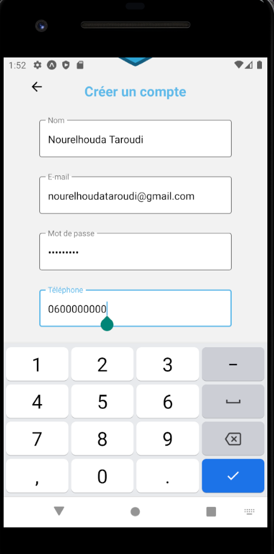
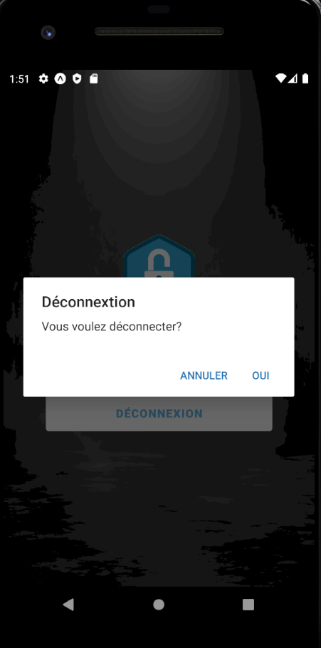

# React Native Auth App

## Content
* [How to use](#Howtouse?)
* [Interfaces](#interfaces)

## How to use?

1. Download or clone this repo.

2. Install dependencies.

```js
npm install

```

3. Run project on iOS / Android.

```js
 npm run ios // npm run android
```

## Interfaces 

### Start
<p align="center">
  
</p>

### Register

<p align="center">
  
</p>

<p align="center">
  
</p>

<p align="center">
  
</p>

<p align="center">
  
</p>

## Login
<p align="center">
  
</p>

## Dashboard
<p align="center">
  
</p>

### Sign Out
<p align="center">
  
</p>

## Forget Password
<p align="center">
  
</p>


***Thank you for reading***
